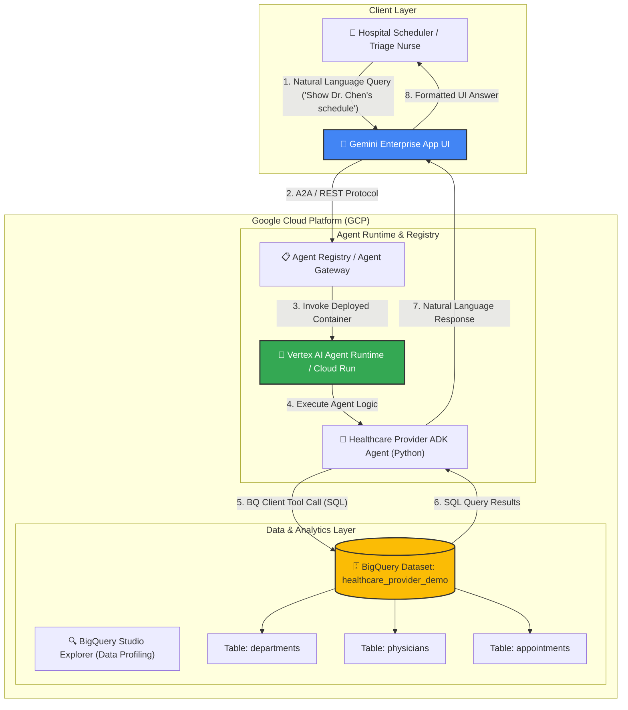
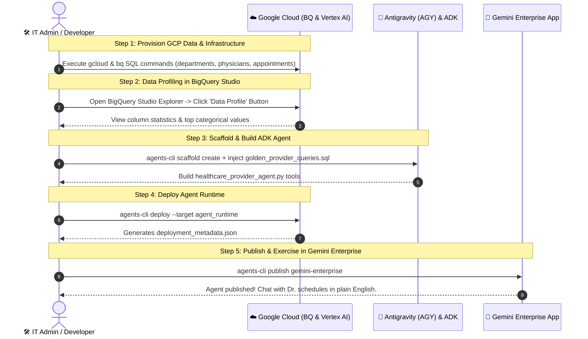

# Complete End-to-End Demo Guide: Healthcare Provider Scheduling Agent to Gemini Enterprise

This comprehensive guide provides an **end-to-end Healthcare Provider Clinical Operations & Patient Scheduling Agent demo**. It walks you through building an agent using **Google Agent Development Kit (ADK)**, provisioning BigQuery datasets, profiling data in BigQuery Studio Explorer, deploying to **Vertex AI Agent Runtime**, and publishing to **Gemini Enterprise App**.

---

## 🏥 Use Case: Hospital Clinical Operations & Physician Scheduling

Hospital operational managers, clinic schedulers, and triage nurses spend significant time navigating clinical systems to check doctor availability, review appointment queues, locate clinical departments, and manage patient consults.

**The Solution**: An ADK-based **Healthcare Provider Data Agent** that translates natural language inquiries into secure BigQuery SQL queries over hospital scheduling and physician databases, returning real-time answers directly in **Gemini Enterprise App**.

---

## 🏗️ End-to-End System Architecture

The diagram below illustrates the end-to-end data flow from Gemini Enterprise App down to BigQuery:



---

## 📋 Step-by-Step Implementation Blueprint



---

## Step 1: Provision GCP Infrastructure & Synthetic Provider Data

Run these commands in Cloud Shell or terminal to set up the dataset and tables (`departments`, `physicians`, `appointments`).

```bash
export PROJECT_ID="<YOUR_GCP_PROJECT_ID>"
export REGION="us-east1"
export DATASET_ID="healthcare_provider_demo"

gcloud config set project $PROJECT_ID

# Enable GCP APIs
gcloud services enable \
  bigquery.googleapis.com \
  aiplatform.googleapis.com \
  discoveryengine.googleapis.com \
  run.googleapis.com \
  cloudbuild.googleapis.com

# Create BigQuery Dataset
bq --location=$REGION mk --dataset ${PROJECT_ID}:${DATASET_ID}

# Load Synthetic Provider Data from starter-kit SQL file
bq query --use_legacy_sql=false < starter-kit/data/synthetic_healthcare_provider_dataset.sql
```

---

## Step 2: Data Profiling in BigQuery Studio Explorer

1. Open [BigQuery Studio](https://console.cloud.google.com/bigquery).
2. Expand `${PROJECT_ID} -> healthcare_provider_demo` in the left Explorer tree.
3. Select `appointments` table and click the **Data Profile** tab in the main pane.
4. Note key column statistics:
   - `appointment_status` values: `'SCHEDULED'`, `'COMPLETED'`, `'CANCELLED'`, `'NO_SHOW'`.
   - `reason_for_visit` sample values: `'Annual Cardiac Follow-up'`, `'Echocardiogram Review'`.

---

## Step 3: Scaffold & Build ADK Data Agent with Golden Queries

1. **Scaffold Project**:
   ```bash
   agents-cli scaffold create --template default healthcare-provider-agent
   cd healthcare-provider-agent
   ```

2. **Copy ADK Python Tool**:
   Copy `starter-kit/agents/adk_agent_template/healthcare_provider_agent.py` into your agent workspace.

3. **Inject Golden Queries & Profile Insights into AGY**:
   Prompt AGY in chat:
   > *"AGY, build `healthcare-provider-agent` using `healthcare_provider_agent.py`. Inject the golden query patterns from `starter-kit/data/golden_provider_queries.sql` and our BigQuery Data Profile insights (`appointment_status` values) into the system prompt."*

4. **Test Agent Locally**:
   ```bash
   agents-cli run
   ```
   *Prompt*: `"Show me all scheduled appointments for Dr. Robert Chen on 2024-09-10."`

---

## Step 4: Deploy Agent to Vertex AI Agent Runtime

1. **Grant BigQuery IAM Permissions**:
   ```bash
   gcloud projects add-iam-policy-binding $PROJECT_ID \
     --member="user:$(gcloud config get-value account)" \
     --role="roles/bigquery.dataViewer"
   ```

2. **Deploy Container via CLI**:
   ```bash
   agents-cli deploy \
     --target agent_runtime \
     --project-id $PROJECT_ID \
     --region $REGION
   ```
   *Output*: Generates `deployment_metadata.json` containing the deployed agent endpoint resource ID.

---

## Step 5: Publish to Gemini Enterprise App

Publish the deployed agent directly to your enterprise workspace:

```bash
agents-cli publish gemini-enterprise --interactive
```
- Select your target **Gemini Enterprise App ID**.
- Display Name: `"Hospital Physician Scheduling & Operations Agent"`.
- Description: `"Answers natural language inquiries regarding doctor availability, scheduled patient appointments, and clinical department locations."`

---

## Step 6: Exercising the Agent in Gemini Enterprise UI

Log into **Gemini Enterprise App** and test these clinical scenarios:

### 🧪 Test Prompt 1: Doctor Schedule Inquiry
> **User**: *"What appointments does Dr. Robert Chen have scheduled for September 10, 2024?"*
> **Agent Response**: *"Dr. Robert Chen has 1 appointment scheduled on 2024-09-10: APT-8001 for patient PAT-101 at 09:00 AM (Reason: Annual Cardiac Follow-up) in Cardiology."*

### 🧪 Test Prompt 2: Department Location & Specialist Search
> **User**: *"Which department handles Cardiology and where is it located?"*
> **Agent Response**: *"Cardiology (DEP-101) is located at 'Heart & Vascular Center - 3rd Floor'. The head physician is Dr. Robert Chen."*

---

## 🛑 Verification & Diagnostic Checklist

| Checkpoint | Command / Action | Expected Result |
| :--- | :--- | :--- |
| **BigQuery Dataset** | `bq ls ${PROJECT_ID}:healthcare_provider_demo` | Lists `departments`, `physicians`, `appointments`. |
| **ADK Local Test** | `agents-cli run` | Returns formatted string of appointment dictionaries. |
| **Agent Runtime Deployment** | `cat deployment_metadata.json` | Displays valid `remote_agent_runtime_id`. |
| **GE App Integration** | Open Gemini Enterprise App UI | Agent icon appears in App Extensions / Agents list. |
